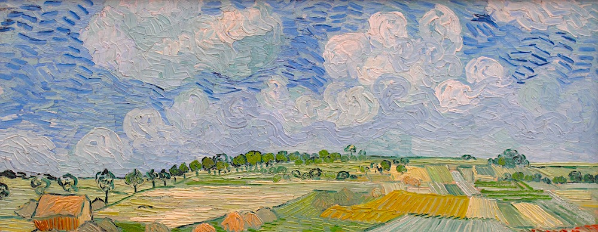

# MSU Cloud Fellowship 2021-2022

Welcome to the website for the MSU Cloud fellowship for 2021-2022.  See our "[about](about.md)" page for more information about the program.   

## Syllabus 

The program runs from Fall 2021 to Spring 2022 semester.  Sessions are organized with pre-meeting materials (readings and videos), pre-requisites, and activities, which allow fellows to prepare for our Friday meetings where we will have hands-on activities and discussion.  

### Schedule for Fall 2021

 * [Session 1](session_introduction): Introduction to the 21-22 Fellowship
     * Sept 3: Meeting : program introductions and program overview (via zoom)
 * [Session 2](session_how_to_cloud): Using the cloud for computing
    * Sept 10: Using Virtual Machines workshop 
 * [Session 3](session_cloud_storage): Cloud Storage
    * Sept 24: Cloud Storage Workshop 
 * [Session 4](session_moving_data): Moving data to the cloud
    * October 8: Data utilities and services workshop (Azure Data Factory)
 * [Session 5](session_bigdata): Big Data Systems and the cloud
    * Oct 22: Overview of Big Data on Azure with DataBricks
 * [Session 6](session_datasystems): Databases and Data Analytics Systems on the Cloud
    * Oct 29: Overview of Databases on the cloud, SQL demonstration
 * Session 7: Serverless and Application Development 
    * Nov 12: TBD
 * Session 8: Wrap up and project proposals
    * Dec 3: Meeting : review and feedback on project proposals & general discussion
    * Dec 17: Final cloud fellowship project proposal submission date

### Schedule for Winter/Spring 2022

We will schedule group discussion sessions on project progress, and additional monthly 1-1 sessions with fellowship coordinators to assist with participant projects. Dates to be determined. 

Fellows will present their projects during a symposium to be held April 2022.  

## Text

We will occasionally link to the following book: 

**"Cloud Computing for Science and Engineering", Ian Foster and Dennis B. Gannon, September 2017**  

  * *[MIT Press website](https://mitpress.mit.edu/books/cloud-computing-science-and-engineering)* 
  * Book Website : [Cloud4SciEng.org](https://cloud4scieng.org)

The book website does provide open access to individual chapters. 

## Communications

 Fellows are encouraged to contact us with questions or if they are ever stuck on an activity we've assigned.  In addition to email, we are utilizing Microsoft Teams at MSU (Fellows receive a link in the welcome email).   Please feel free to reach on out the MS Teams channel sent to participants at the beginning of the program.  Mentioning one of us e.g. @billspat or @parvizm will help get our attention.  Additionally you may email us at any time.   If you are not a participant but have questions about the program, see the [Contact page](contact.md) for how to get in touch with us.   

If you see a question or discussion on Teams please feel free to add any info or advice you may have, or even let us know that you have a similar question or issue.    

If you need interactive, on-going help it may be better to schedule a help session with a fellowship coordinator; and we are happy to meet individually for additional support.   This may be especially effective when fellows are developing their projects.  

We also save time during our synchronous meetings for group discussions, so please bring any concerns, difficulties, or successes to our sessions! 

## Meeting location

Given the state of the pandemic in late summer 2021, we are hosting our first meeting (September 3) via zoom.  Participants will be sent a link via email.   Locations for future meetings are to be determined and based on participant feedback.  

---
   
 This work is licensed under a <a rel="license" href="http://creativecommons.org/licenses/by-nc/4.0/">Creative Commons Attribution-NonCommercial 4.0 International License</a>

---
